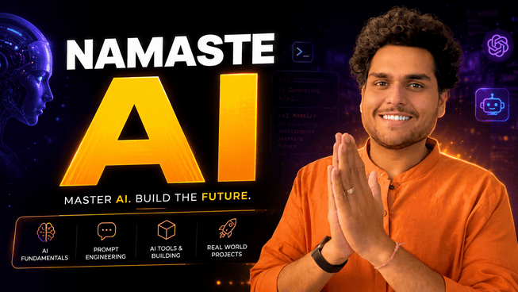

# Namaste AI

My learning repository for **Namaste AI by Akshay Saini**.

Contains:
- Notes and key concepts
- Code snippets and implementations
- Experiments and projects
- Useful resources

## About

Namaste AI covers:

**LLMs · Transformers · Tokenization · Embeddings · Context · Hallucinations · Prompting · Context Engineering · Structured Outputs · Tool & Function Calling · LLM API Integration · Streaming AI Responses · Multimodal AI · Semantic Search · Vector Databases · Document Ingestion · Chunking Strategies · Retrieval Strategies · RAG · AI Agents · Model Context Protocol (MCP) · Multi-Agent Architectures · AI-Assisted Coding · Debugging · Testing · Code Review · Documentation · Deployment**

The course follows a **JavaScript-First AI Development** approach, with **Python Wherever Required**.

## Notes & Curriculum

### Season 1: Inside the Mind of AI

| Episode | Title | Notes |
| :---: | :--- | :---: |
| 01 | Welcome to Namaste AI | [Read Notes](season-01-inside-the-mind-of-ai/episode-01/welcome-to-namaste-ai.md) |

---

[Learn more about Namaste AI](https://namastedev.com/learn/namaste-ai)

> This is a personal learning repository and is not affiliated with or maintained by NamasteDev or Akshay Saini.