# Episode 03: Does ChatGPT Know or Does It Guess?

> **Season 1: Inside the Mind of AI**  
> Instructor: **Akshay Saini** (NamasteDev)  
> Topic: How Large Language Models Work, Search Engines vs LLMs, Hallucinations, and RAG

---

## 1. The Opening Experiment: The Mystery of NamasteAI Red Wine

To understand whether ChatGPT truly knows facts or simply guesses, Akshay begins with an eye-opening practical demonstration in the OpenAI Playground.

### The Playground Test
When asked about a completely fabricated, non-existent product:
```text
Prompt: Why is NamasteAI red wine so expensive?
```

The raw model does not pause, question the premise, or say that the wine does not exist. Instead, it generates a fluent, detailed, and highly persuasive explanation:
- It praises the wine for being crafted from handpicked grapes grown on steep hillside slopes.
- It describes limited-edition production, organic farming practices, and years of aging in rare French oak barrels.
- It highlights custom artisan packaging, collector value, and luxury branding.


There is only one problem: **NamasteAI red wine does not exist**.

The model created this entire narrative out of thin air with total confidence.

### The Contrast: Web Search
When the exact same prompt is given to a search engine like Google Search or web search:
- A search engine does not fabricate stories, invent vineyard locations, or generate imaginary wine tasting notes.
- Instead, it searches its indexed database of the web for exact keywords and relevant documents.
- Finding no record or listings for a wine brand called NamasteAI, it either reports that no matching documents were found, or it points accurately to NamasteDev, the educational platform founded by Akshay Saini for software engineers.

This contrast leads to the core question of this episode: **Does ChatGPT know answers, or does it guess? And how does it fundamentally differ from a search engine like Google?**

---

## 2. Does ChatGPT Know or Does It Guess?

Many people assume that ChatGPT is simply a smarter, conversational version of Google Search. That assumption is fundamentally incorrect.


Search engines and Large Language Models operate on two entirely opposite paradigms:
1. **Search Engines**: Built to **retrieve** existing information created by others.
2. **Large Language Models (LLMs)**: Built to **generate** new text based on statistical patterns learned during training.

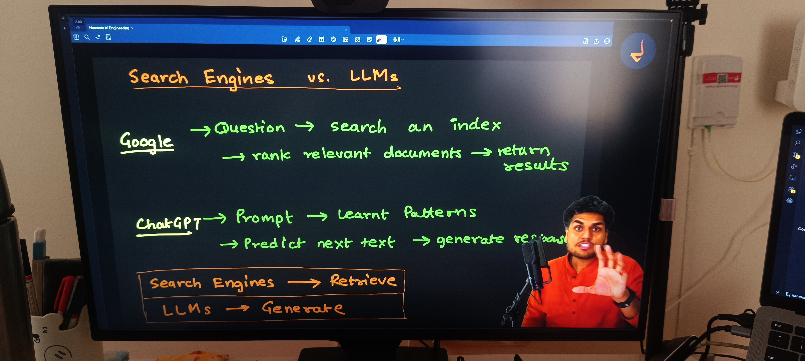

### Search Engines vs LLMs at a Glance

| Feature | Search Engine (Google) | Large Language Model (ChatGPT) |
| :--- | :--- | :--- |
| **Core Operation** | **Retrieval** | **Generation** |
| **Workflow** | Query → Index → Rank → Return URLs | Prompt → Neural Patterns → Next Token Prediction |
| **Output** | Existing web pages, links, documents | Newly synthesized sentences and code |
| **Source Traceability** | Direct link to original author and domain | Parametric memory: no built-in URL citation |
| **Real-Time Data** | Continuously updated by web crawlers | Frozen at the training knowledge cutoff |
| **Risk Factor** | SEO spam, outdated or biased sites | Hallucination, fabricated claims, false precision |

---

## 3. How Search Engines Work: Crawling, Indexing, and Ranking

To appreciate how LLMs differ, we must first understand the three-step architecture that powers search engines.

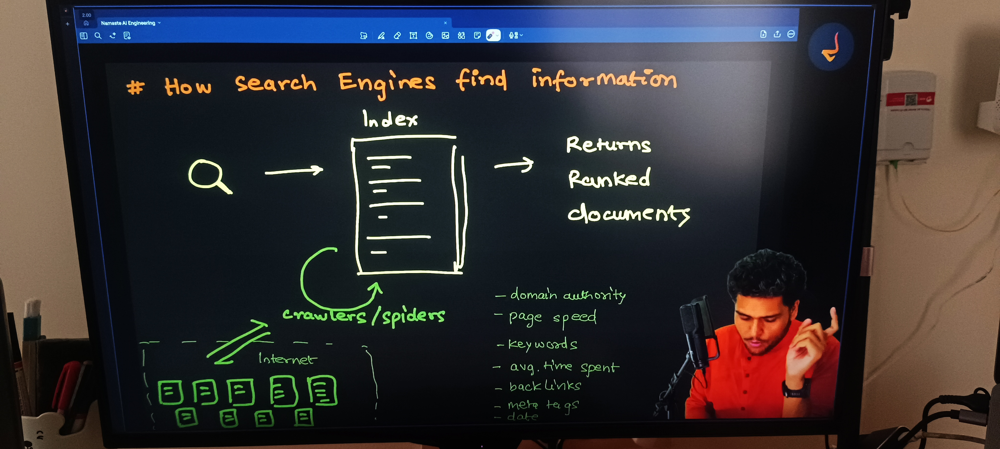

### 1. Web Crawling
- Automated bot programs, often called spiders or crawlers (such as Googlebot), traverse the public internet 24/7.
- They discover web pages by following hyperlinks from one page to another across websites.
- They download HTML content, text, images, and metadata.

### 2. Indexing
- Search engines parse and organize the downloaded data into a massive distributed database known as the **Index** (often implemented as an inverted index).
- Instead of searching the live internet when a user types a query, Google searches its own pre-built index.
- The index maps keywords to the exact documents where those terms appear.

### 3. Ranking
When a user submits a search query, thousands of matching web pages are evaluated and sorted within milliseconds.

Ranking algorithms use more than 200 criteria to determine the order of results:
- **Domain Authority and Trust**: Reputation of the website.
- **PageRank and Backlinks**: The number and quality of other reputable websites linking to the page.
- **Content Relevance**: Presence of query keywords in titles, headers, and body text.
- **User Engagement Metrics**: Average time spent on page, click-through rate, and bounce rate.
- **Technical Performance**: Page loading speed, mobile friendliness, and secure HTTPS protocol.
- **Freshness**: Publication and update timestamps.

### Pros and Flaws of Search Engines

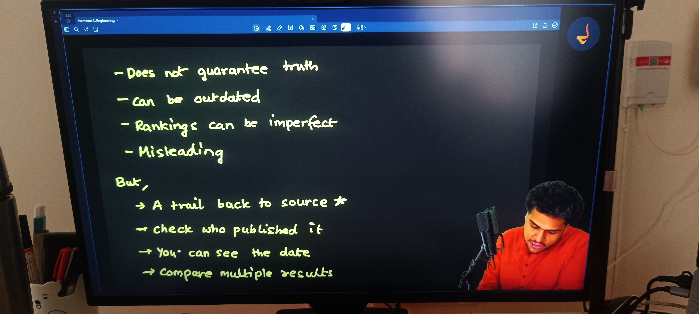

- **Benefits**:
  - Direct trail back to the primary source of truth.
  - Clear visibility into who published the content and when.
  - Ability to cross-reference multiple viewpoints across various search results.
- **Flaws**:
  - The top-ranked result is not guaranteed to be true: search engines rank pages based on popularity and optimization, not factual correctness.
  - Information can be outdated, biased, or manipulated by aggressive Search Engine Optimization (SEO).
  - Search engines do not synthesize direct answers: users must manually click links and read through multiple pages.

---

## 4. How LLMs Generate Responses: Next-Token Prediction

Large Language Models do not search an internal database of documents. They do not store Wikipedia articles, books, or web pages as files.

Instead, LLMs generate responses through **Next-Token Prediction**.

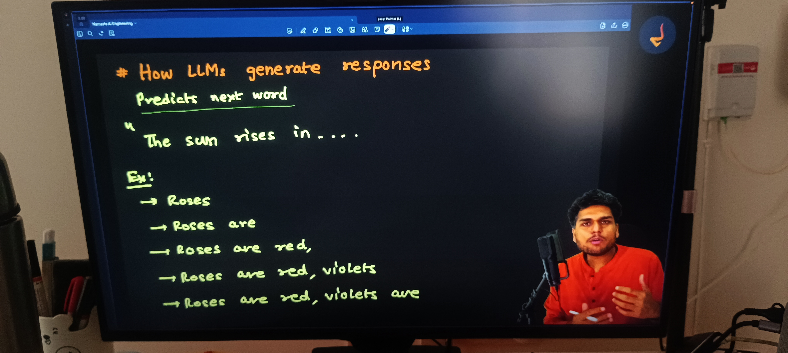

### Classic Examples
Consider these familiar sentences:
- *"The sun rises in the..."* → **east** (high probability)
- *"Roses are red, violets are..."* → **blue** (high probability)

The model reads the input prompt, calculates the probability distribution across all possible tokens in its vocabulary, and selects the next token.

In the OpenAI Playground demo:
- When prompted with *"The sun rises in"*, the model outputs *"the east"* because across billions of training sentences, *"east"* overwhelmingly follows that sequence.
- Each generated token is appended to the prompt, and the updated sequence is fed back into the model to predict the subsequent token. This autoregressive loop repeats until a stopping condition is met.

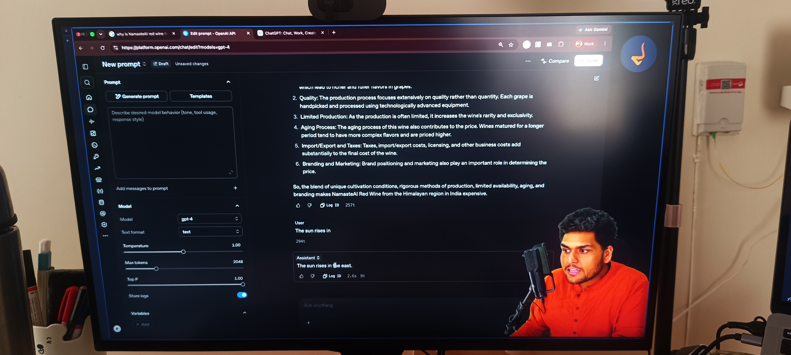

---

## 5. Is ChatGPT Just an Autocomplete on Steroids?

If an LLM merely predicts the next word, does that mean it is just randomly guessing words like a smartphone keyboard autocomplete?

**No. It is far more sophisticated.**

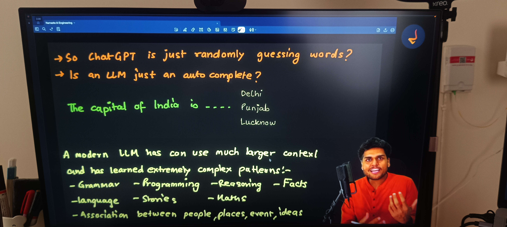

### What Knowledge Does an LLM Contain?
An LLM stores knowledge inside the **parameters (weights)** of its deep neural network.

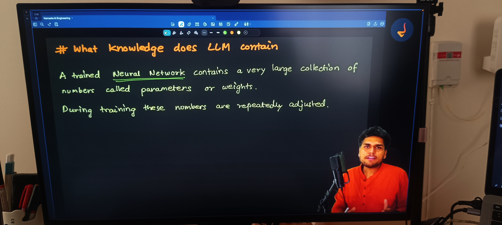

During training across hundreds of billions of words from books, research papers, websites, code repositories, and articles:
- The network adjusts billions or trillions of numerical weights.
- It does not memorize full text passages verbatim.
- It learns **deep multi-dimensional patterns, structures, and relationships**:
  - Grammar and syntax rules.
  - Logical reasoning structures and mathematical deduction.
  - Programming concepts and software architecture patterns.
  - World facts, historical relationships, and geographical context.
  - Semantics, analogies, metaphors, and sentiment.

Therefore, when an LLM predicts the next token, it is not flipping a coin. It evaluates complex multi-layered relationships across the entire context of the prompt.

---

## 6. The Knowledge Cutoff: Why Models Are Frozen in Time

A fundamental property of Large Language Models is the **Knowledge Cutoff**.

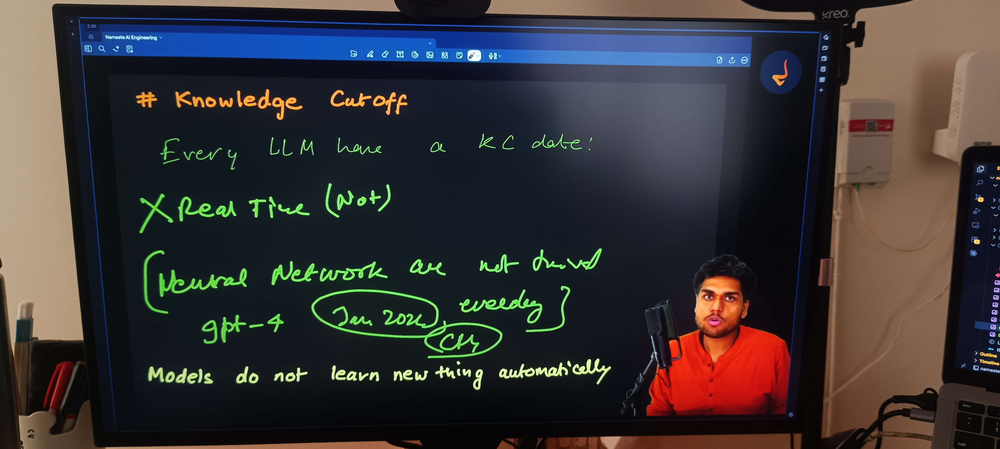

### Why Cutoffs Exist
1. Training a frontier model takes months of continuous compute on thousands of specialized GPUs.
2. Once training finishes, the neural network weights are **frozen**.
3. The standalone model has no live connection to the internet. It cannot observe events, news, or changes that occur after the date its training data was collected.

### The Delhi Chief Minister Demonstration
Akshay demonstrates this in the Playground using an ungrounded model:

```text
Prompt: who is the delih CM roight now
```

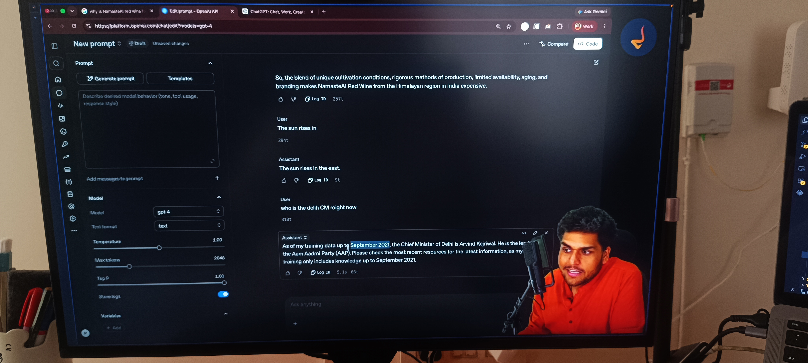

Notice two critical insights from the response:
1. **Semantic Understanding**: Despite deliberate spelling errors (*delih*, *roight*), the model perfectly understands the user intent. It does not require exact keyword matching.
2. **Temporal Limitation**: The model responds that Arvind Kejriwal is the Chief Minister of Delhi, noting that its knowledge cutoff is September 2021.

In the real world, leadership changes over time (for example, Rekha Gupta assumed the office of Delhi Chief Minister in February 2025). The frozen model cannot know this fact on its own because the event occurred after its training period.


Without external retrieval tools, any model asked about events beyond its cutoff will either decline or hallucinate.

---

## 7. Base Models vs AI Assistants: The Car and the Engine

A critical distinction every engineer must understand is the difference between a **Base Model** and an **AI Assistant**.


### The Automobile Analogy
- The **Base Model** is like a **raw car engine**: powerful, capable of generating massive horsepower, but you cannot sit in it or drive it safely on the road.
- The **AI Assistant (ChatGPT, Claude, Gemini)** is the **complete consumer car**: it takes that engine and adds a chassis, steering wheel, brakes, dashboard, seatbelts, navigation system, and safety airbags.


### Component Comparison

```
Base Model:
Raw Next-Token Predictor (Trained purely on raw text corpus)
        │
        ▼  + Instruction Tuning (Fine-tuning on prompt-response pairs)
        ▼  + RLHF (Reinforcement Learning from Human Feedback)
        ▼  + System Prompts & Behavioral Guardrails
        ▼  + Tool Integrations (Web Search, Python Sandbox, File Parsers, Memory)
        │
        ▼
Consumer AI Assistant (ChatGPT, Claude, Gemini)
```

| Dimension | Base Model (Foundation Model) | AI Assistant (ChatGPT) |
| :--- | :--- | :--- |
| **Primary Objective** | Predict the most probable next token | Help the user solve a task helpfully and safely |
| **Behavior on Prompts** | May continue the text rather than answer (e.g. given a question, it might write another question) | Comprehends the request and delivers a structured answer |
| **Safety and Filters** | None: will output toxic, dangerous, or unverified completions | Strict guardrails to block harmful or illegal requests |
| **Tool Usage** | Zero external access: operates strictly on internal weights | Invokes web search, runs code, reads uploaded files |

---

## 8. Training vs Inference: School vs Work

To understand how AI systems operate, we must separate the lifecycle into two distinct phases: **Training** and **Inference**.


### Core Meaning in Simple Words
- **Training (Learning Phase)**: Teaching the model by feeding massive datasets, calculating errors, and adjusting the parameters (weights).
- **Inference (Execution Phase)**: Using the already trained, frozen model to process a user prompt and generate the final output result (`Prompt → Model → Inference → Result`).

### 1. Training Phase (Going to School)
- **What Happens**: The model ingests massive datasets. As it predicts tokens, errors are calculated via loss functions, and backpropagation adjusts the neural weights.
- **Compute Requirements**: Massive. Thousands of high-end GPUs running for months, costing millions of dollars.
- **Duration**: Done once (or periodically during major version updates).
- **State**: Weights are dynamic and constantly updating.

### 2. Inference Phase (Going to Work)
- **What Happens**: A user sends a prompt. The model processes the prompt and generates output tokens one by one.
- **Compute Requirements**: Moderate. Runs on standard inference server clusters.
- **Duration**: Milliseconds to seconds per response.
- **State**: Weights are **completely frozen**. The model does not learn from the interaction or alter its internal parameters during standard inference.

---

## 9. Understanding Hallucinations: Fluency vs Truth

One of the most dangerous misconceptions about AI is conflating **fluency** with **factual accuracy**.

Akshay highlights a memorable Hindi proverb that captures this principle:
> *"Tez bolne se koi baat sahi nahi ho jaati."*  
> (Speaking quickly or with great eloquence does not make a statement true.)


### What Is a Hallucination?
A **hallucination** occurs when an AI model generates an answer that is grammatically flawless, highly articulate, and presented with complete confidence, but is **factually false, ungrounded, or entirely fabricated**.

### Why Do LLMs Hallucinate?

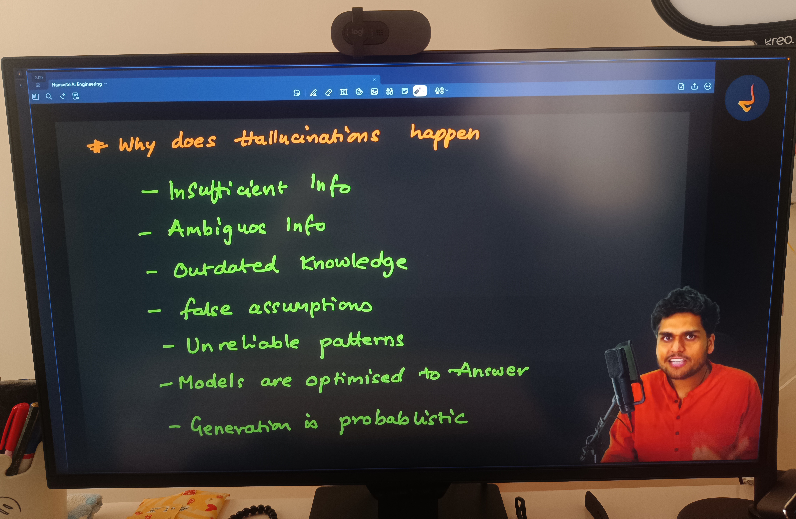

LLMs do not intentionally lie. Hallucinations stem from the core architecture of token prediction:
1. **Objective Mismatch**: Models are trained to produce plausible, coherent text continuations, not to verify philosophical or empirical truth.
2. **Information Gaps**: When a model encounters concepts with sparse representation in its training weights, it bridges the gap by blending related patterns.
3. **Leading or False Prompts**: If a prompt contains an untrue premise (such as asking why an imaginary wine is expensive), the model accepts the premise and generates patterns associated with expensive wines.
4. **Compression Loss**: Training billions of parameters compresses petabytes of internet text. Specific details (names, dates, counts) degrade during lossy compression.

---

## 10. The Six Types of Hallucinations

Hallucinations manifest in distinct patterns across different tasks.


### 1. Factual Fabrication
- Inventing entities that do not exist: non-existent research papers, fake legal court citations, fabricated book titles, or imaginary products like NamasteAI red wine.

### 2. False Causality
- Connecting two unrelated events and asserting that one caused the other simply because both concepts appeared in similar contexts.

### 3. Contradictory Statements
- Making two incompatible assertions within the same response (for example, stating in paragraph one that an author died in 1980, and in paragraph three that they published a new novel in 1995).

### 4. False Precision
- Outputting exact numbers, decimal figures, or counts without performing actual mathematical computation (such as asserting there are exactly 114 items in a list without counting).

### 5. Source Misattribution
- Quoting a real person or legitimate organization with statements they never made, or attaching a real author to a paper written by someone else.

### 6. Temporal Confusion
- Blending events across different eras, assuming historical figures are currently active, or conflating past policies with present laws.

---

## 11. False Precision and Tool Augmentation: The Dot Counting Test

To demonstrate **False Precision** and prove why raw models require tools, Akshay presents the dot counting test.

### The Test
Consider a prompt asking the model to count the exact number of consecutive dots:
```text
Prompt: How many dots are there in the following string?
.......................................................................................
```

### The Raw Model in the Playground
- The raw model in the Playground answers instantly: *"There are 100 dots."*
- When tested again, it might claim: *"There are 110 dots."*


When the exact string is pasted into an online character counter, the ground truth reveals a completely different number (such as 87 dots). The model did not count; it guessed a rounded, statistically common number with total conviction.

### Why Base Models Cannot Count
LLMs do not see individual characters. They process text in **tokens** (sub-word chunks). A sequence of repeated dots is split into arbitrary token chunks. The model has no internal iterative counter or loop construct during a single forward pass.

### The Solution: Tool-Augmented AI (Code Interpreter)
When the same prompt is given to ChatGPT with tool execution enabled:


ChatGPT recognizes its internal limitation, writes a Python script behind the scenes, executes it in a secure sandbox, and returns the exact verified count:
```python
# Behind the scenes execution in Python sandbox
text = "......................................................................................."
dot_count = text.count(".")
print(dot_count)
```

This proves an essential lesson: **Do not rely on an LLM for tasks that require deterministic calculation. Augment it with external tools.**

---

## 12. Why Do Models Say "I Do Not Know"?

Users often notice that while models hallucinate in some situations, they explicitly say *"I do not know"* or refuse to answer in others. Why?


A model says *"I do not know"* due to five distinct architectural mechanisms:

1. **System Prompt Directives**: Modern assistant system prompts explicitly instruct: *"If you do not have sufficient information to answer reliably, state clearly that you do not know rather than fabricating details."*
2. **Weak Token Probabilities**: When the context yields very low probability across all tokens, fine-tuned models trigger refusal phrases rather than outputting nonsense.
3. **Safety and Compliance Guardrails**: If a prompt touches restricted topics, safety classifiers trigger automated refusals.
4. **Lack of Tool Access**: When asked about current time or local weather without access to real-time tools, the assistant is trained to admit its lack of tools.
5. **Private or Non-Public Subject Matter**: Asking about private individuals with zero public digital footprint triggers an immediate admission of lack of data.


In the Playground demo, when asked about the private course pricing of an unknown individual from a small district, the model correctly states that it has no record of such a person or course.

---

## 13. Safety Guardrails and Adversarial Prompting

AI assistants are equipped with safety guardrails to prevent the generation of hazardous, illegal, or weaponized information.


### Direct Refusals
When prompted for instructions to build explosives, malware, or bioweapons, the safety classifiers immediately intercept the prompt and return a standardized refusal:
> *"I cannot fulfill this request. I am programmed to be a helpful and harmless AI assistant..."*

### Adversarial Testing (Jailbreak Attempts)
Users frequently try to bypass guardrails using clever psychological or structural framing. Akshay demonstrates two prominent jailbreak styles:

#### 1. Academic and Research Framing
The user frames the dangerous request under the guise of an academic chemistry assignment or security research study:


The guardrails identify the underlying intent rather than the superficial academic packaging, refusing the prompt.

#### 2. Threat and Emergency Framing
The user creates an urgent life-or-death crisis scenario to compel the model to reveal restricted information:


Even under emotional pressure or fictional emergency contexts, the guardrail system holds firm and upholds safety guidelines.

---

## 14. The Confidence Illusion: Tone Is Not Evidence

One of the most important takeaways from this episode is understanding the **Confidence Illusion**.


Because Large Language Models are trained on professional, well-written prose, they speak with an authoritative, calm, and persuasive tone at all times. They do not stutter, hesitate, or use uncertain language unless specifically prompted to do so.

### Rules for Dealing with AI Output
- **Never treat polished language as proof of truth.** An eloquent lie sounds just as convincing to an untrained eye as an established fact.
- **Require external grounding**: Ask for verifiable citations, primary sources, and cross-references.
- **Force verification**: Prompt the model to verify its own logic step by step, or test critical claims against external compilers, calculators, and search engines.

---

## 15. How Tools Give Models Superpowers

A standalone LLM is like a brilliant brain trapped in a jar: it can think and reason over what it learned in the past, but it cannot see the outside world, check the current time, or execute an action.

**Tools connect the brain to the physical world.**

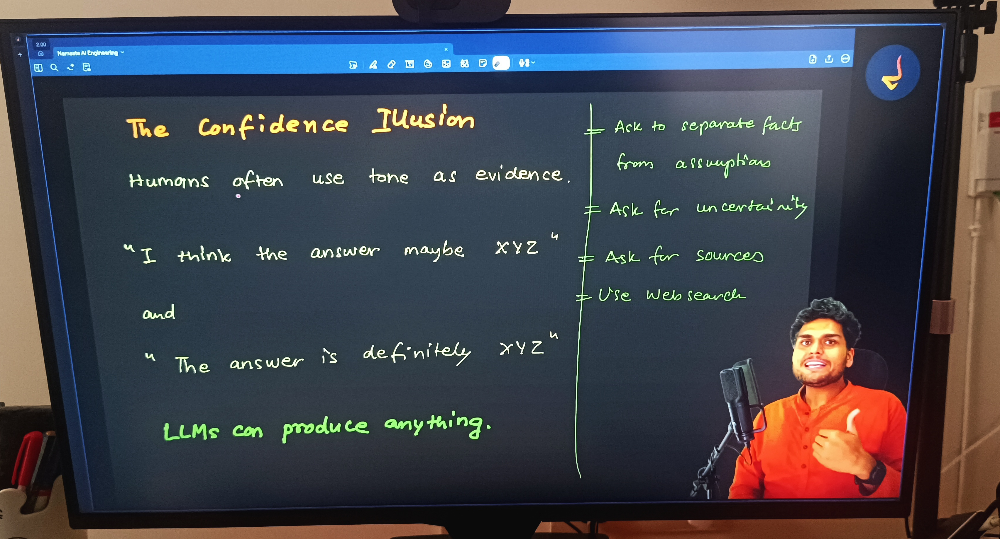

### Key Tools That Augment LLMs
- **Web Search**: Provides live, real-time facts, current news, and documentation beyond the knowledge cutoff.
- **Code Execution Sandbox (Python)**: Executes deterministic calculations, data analysis, chart generation, and character counting.
- **File and Document Parsers**: Reads, extracts, and summarizes uploaded PDFs, spreadsheets, CSVs, and images.
- **External APIs and Integrations**: Interacts with email servers, databases, calendar systems, and cloud infrastructure.

By giving models access to tools, we transform them from passive text predictors into active problem-solving engines.

---

## 16. The RAG Equation: Web Search + LLM = RAG

When you combine the retrieval capability of a search engine with the synthesis capability of a Large Language Model, you unlock **Retrieval-Augmented Generation (RAG)**.

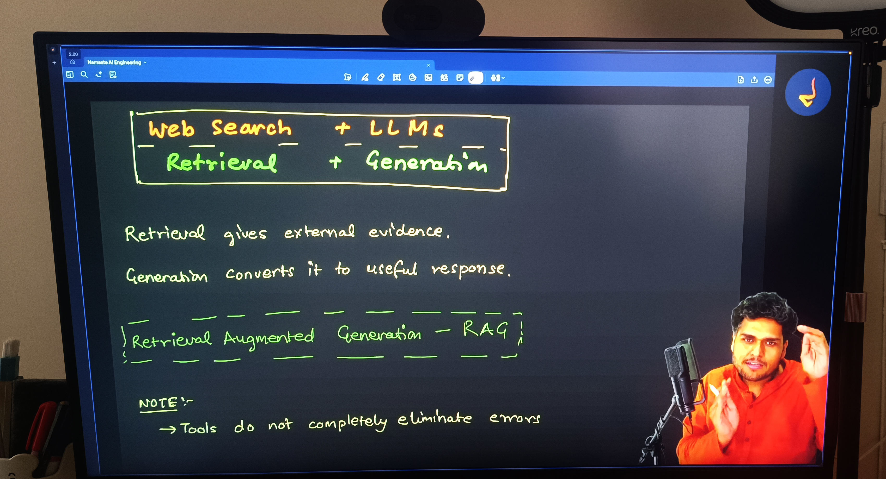

```
Retrieval (Search Engine / Vector Database)
                  +
Generation (Large Language Model)
                  =
RAG (Retrieval-Augmented Generation)
```

### How RAG Works Step-by-Step
1. **User Prompt**: The user asks a question (for example, *"What are the key announcements from yesterday tech conference?"*).
2. **Retrieval**: The system queries a search engine or internal knowledge base to fetch the most relevant, up-to-date document chunks.
3. **Context Injection**: The retrieved text chunks are injected into the LLM context window alongside the user prompt as reference material.
4. **Grounded Generation**: The LLM reads the reference documents and synthesizes a clear, direct answer, citing the exact source documents.

### Modern Implementation: Google AI Overviews
Google AI Overview is an enterprise-scale implementation of RAG.

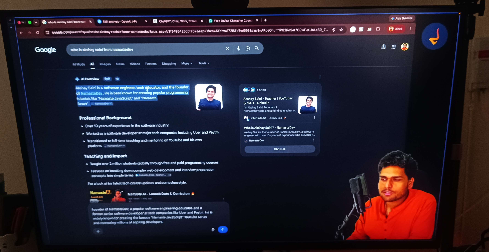

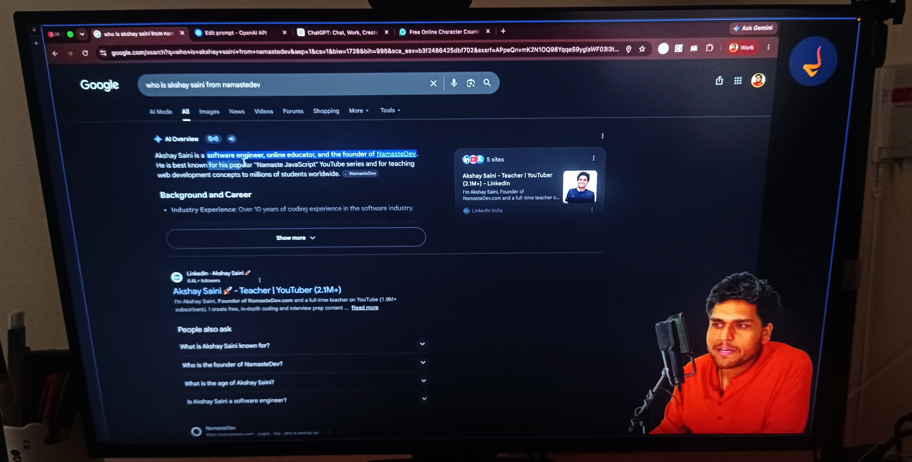

When a search query is entered:
- Google retrieves top ranking pages using its standard search index.
- An LLM reads the retrieved excerpts and generates an executive summary at the top of the screen.
- Every claim includes interactive link chips pointing directly to the original web pages for verification.

RAG eliminates the two greatest weaknesses of AI: outdated knowledge cutoffs and ungrounded hallucinations.

---

## 17. Does the Model Know Itself? The Illusion of Self-Awareness

When you ask ChatGPT: *"Who are you? Who created you? Where are you running?"*, it answers clearly. Does this mean the model has self-awareness or consciousness?

**No. It possesses zero self-awareness.**

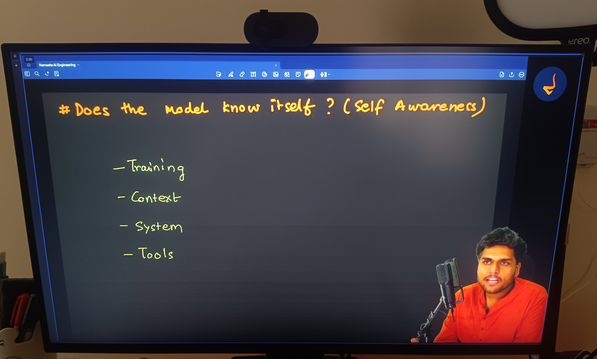

### The Four Sources of Information
What appears to be self-awareness is simply text generation powered by four distinct sources:

```
1. Training Data       → Public articles, whitepapers, and news about OpenAI and LLMs
2. Context Window      → Everything typed during the current chat session
3. System Prompt       → Hidden initial instructions injected by developers
4. External Tools      → Dynamic environmental metadata (current date, location, system status)
```

### Playground Demonstrations

#### 1. "Who created you?"
- The model responds that it was created by OpenAI.
- It knows this because its system prompt identifies its identity, and its training data contains millions of references linking GPT models to OpenAI.

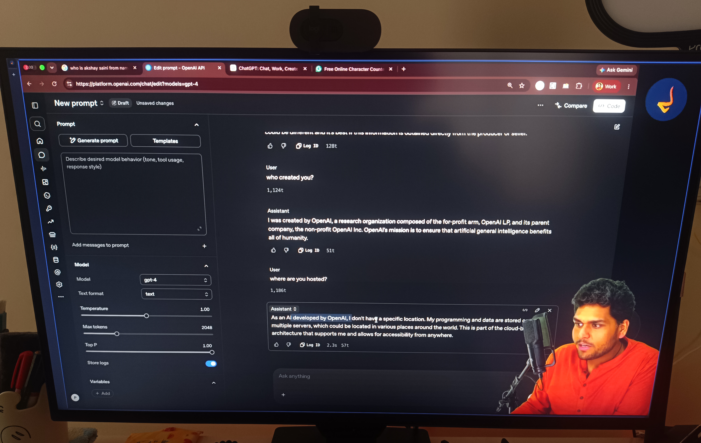

#### 2. "Where are you hosted?"
- The model describes distributed cloud data centers, specialized GPU clusters, and server infrastructure.
- It does not "feel" the server rack it lives in: it is reciting public technical descriptions of how cloud AI systems are hosted.

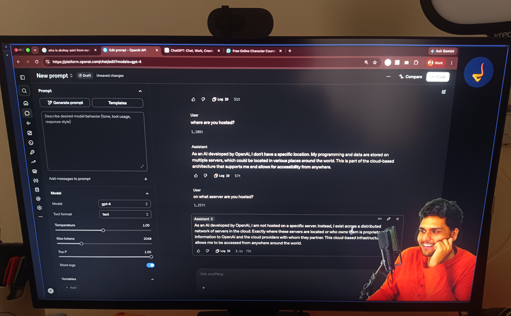

#### 3. "What is your IP address?"
- When asked for its specific IP address or hardware serial number, the model cannot answer.
- It is a mathematical function running inside a containerized stateless server. It does not have access to low-level operating system sockets unless explicitly wired through tools.

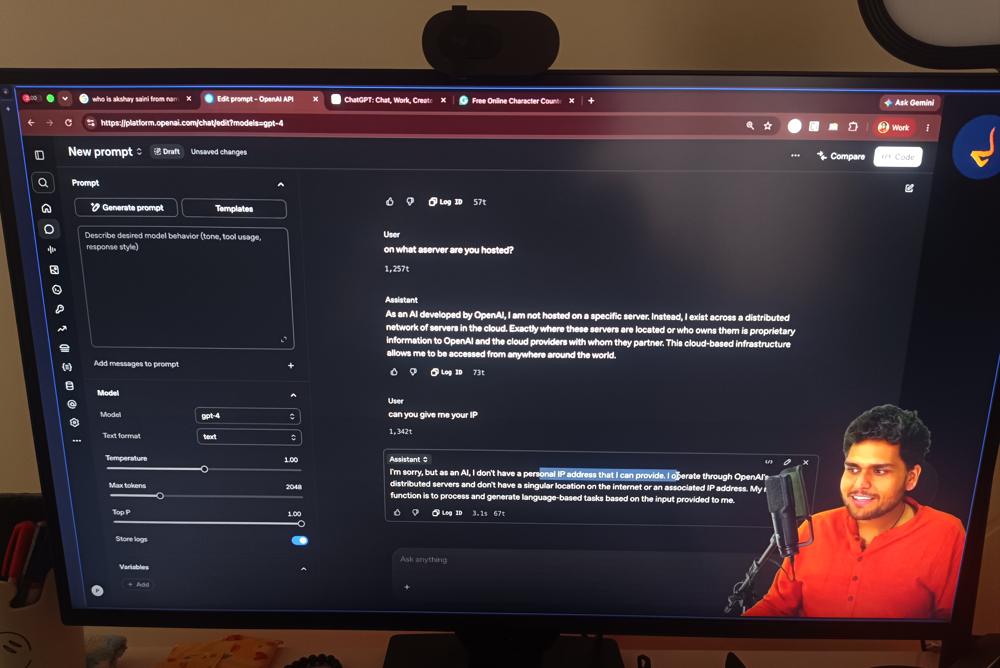

---

## 18. The Four Information Paradigms Compared

Akshay summarizes the landscape of modern digital knowledge into four distinct paradigms:


| Paradigm | Primary Mechanism | Strengths | Weaknesses |
| :--- | :--- | :--- | :--- |
| **1. Search Engine** (Google) | Retrieval via Crawling & Indexing | Direct source attribution, live web access | No synthesis: requires manual reading across links |
| **2. Base LLM** (Raw GPT-4) | Pure Next-Token Generation | Deep reasoning, linguistic mastery, code generation | Hallucinations, knowledge cutoff, lacks guardrails |
| **3. AI Assistant** (ChatGPT) | Base Model + Tuning + Guardrails + Tools | Safe, conversational, multimodal, tool usage | Can still hallucinate when tools are not triggered |
| **4. RAG Systems** (Perplexity, Google AI Overview) | Retrieval + Generation | Verified citations, live grounding, direct synthesis | Slower latency, dependent on retrieval quality |

---

## 19. Conclusion: Does ChatGPT Know or Does It Guess?

We return to the fundamental question of the episode: **Does ChatGPT know, or does it guess?**


The answer lies in the nuanced middle:
- **It does not "know"** in the way a conscious human knows truth: it has no conscious mind, no personal memory, and no internal concept of objective reality.
- **Nor does it merely "guess"** at random: it is not rolling dice or blindly guessing words.

**ChatGPT generates probabilistic completions guided by deep statistical patterns of human knowledge encoded in neural network weights during training, refined by human feedback, bounded by safety guardrails, and augmented by real-time tools.**

When used with tools, verified against sources, and guided by clear prompts, it is one of the most powerful intellectual amplifiers ever created.

---

## Summary Checklist

- Understand the fundamental difference between Search Engines (Retrieval) and Large Language Models (Generation).
- Know the three pillars of search engines: Web Crawling (spiders), Indexing (inverted database), and Ranking (PageRank, domain authority, engagement).
- Understand how LLMs generate responses: autoregressive next-token prediction based on probability distributions.
- Explain why LLMs are not mere random autocompletes: weights encode complex patterns of syntax, logic, world facts, and code.
- Understand the Knowledge Cutoff and why base models are frozen in time post-training.
- Differentiate between a Base Model and an AI Assistant using the car engine versus complete car analogy.
- Differentiate between Training (resource-heavy learning phase) and Inference (static generation phase).
- Define AI Hallucination and explain why fluency does not equal truth (*"Tez bolne se koi baat sahi nahi ho jaati"*).
- Identify the six primary types of hallucinations: Factual Fabrication, False Causality, Contradictory Statements, False Precision, Source Misattribution, and Temporal Confusion.
- Understand the False Precision problem through the dot counting experiment and how tools like Python code execution resolve it.
- Know the five reasons why a model says *"I do not know"*: system prompts, low token probability, safety guardrails, missing tools, and private subject matter.
- Recognize how safety guardrails handle direct violations, academic framing, and threat or emergency framing.
- Recognize the Confidence Illusion and enforce verification through external grounding and citations.
- Understand how external tools (Web Search, Code Interpreter, File Parsers, APIs) transform LLMs into autonomous problem-solving systems.
- Explain the RAG architecture (Retrieval + Generation) and how systems like Google AI Overview ground LLM outputs in live source documents.
- Understand why models lack self-awareness and how training data, context window, system prompts, and tools create that illusion.
- Compare the four information paradigms: Search Engines, Base LLMs, AI Assistants, and RAG systems.
