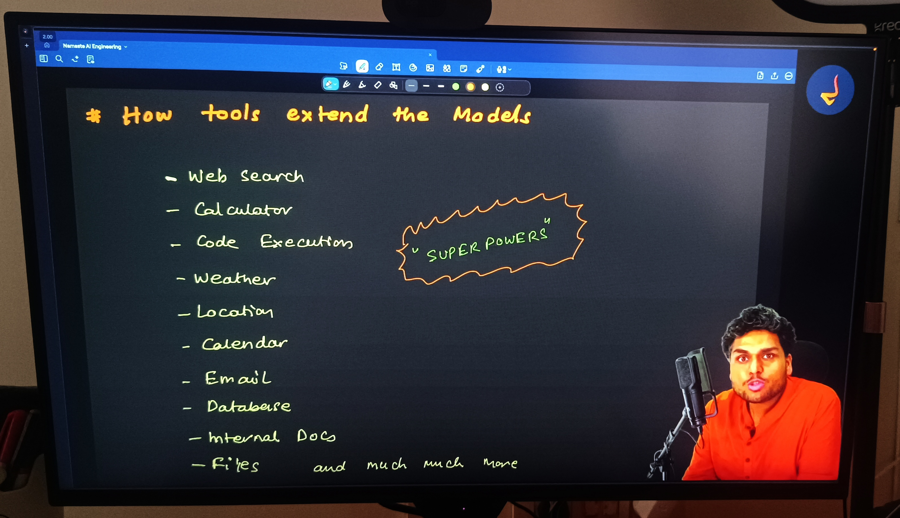

# Episode 03: Does ChatGPT Know or Does It Guess?

> **Season 1: Inside the Mind of AI**  
> Instructor: **Akshay Saini** (NamasteDev)  
> Topic: How Large Language Models Work, Search Engines vs LLMs, Hallucinations, and RAG

---

## 1. The Opening Experiment: The Mystery of NamasteAI Red Wine

To understand whether ChatGPT truly knows facts or simply guesses, Akshay begins with an eye-opening practical demonstration in the OpenAI Playground.

### The Playground Test
When asked about a completely fabricated, non-existent product:
```text
Prompt: Why is NamasteAI red wine so expensive?
```

The raw model does not pause, question the premise, or say that the wine does not exist. Instead, it generates a fluent, detailed, and highly persuasive explanation:
- It praises the wine for being crafted from handpicked grapes grown on steep hillside slopes.
- It describes limited-edition production, organic farming practices, and years of aging in rare French oak barrels.
- It highlights custom artisan packaging, collector value, and luxury branding.


There is only one problem: **NamasteAI red wine does not exist**.

The model created this entire narrative out of thin air with total confidence.

### The Contrast: Web Search
When the exact same prompt is given to a search engine like Google Search or web search:
- A search engine does not fabricate stories, invent vineyard locations, or generate imaginary wine tasting notes.
- Instead, it searches its indexed database of the web for exact keywords and relevant documents.
- Finding no record or listings for a wine brand called NamasteAI, it either reports that no matching documents were found, or it points accurately to NamasteDev, the educational platform founded by Akshay Saini for software engineers.

This contrast leads to the core question of this episode: **Does ChatGPT know answers, or does it guess? And how does it fundamentally differ from a search engine like Google?**

---

## 2. Does ChatGPT Know or Does It Guess?

Many people assume that ChatGPT is simply a smarter, conversational version of Google Search. That assumption is fundamentally incorrect.


Search engines and Large Language Models operate on two entirely opposite paradigms:
1. **Search Engines**: Built to **retrieve** existing information created by others.
2. **Large Language Models (LLMs)**: Built to **generate** new text based on statistical patterns learned during training.


### Search Engines vs LLMs at a Glance

| Feature | Search Engine (Google) | Large Language Model (ChatGPT) |
| :--- | :--- | :--- |
| **Core Operation** | **Retrieval** | **Generation** |
| **Workflow** | Query → Index → Rank → Return URLs | Prompt → Neural Patterns → Next Token Prediction |
| **Output** | Existing web pages, links, documents | Newly synthesized sentences and code |
| **Source Traceability** | Direct link to original author and domain | Parametric memory: no built-in URL citation |
| **Real-Time Data** | Continuously updated by web crawlers | Frozen at the training knowledge cutoff |
| **Risk Factor** | SEO spam, outdated or biased sites | Hallucination, fabricated claims, false precision |

---

## 3. How Search Engines Work: Crawling, Indexing, and Ranking

To appreciate how LLMs differ, we must first understand the three-step architecture that powers search engines.


### 1. Web Crawling
- Automated bot programs, often called spiders or crawlers (such as Googlebot), traverse the public internet 24/7.
- They discover web pages by following hyperlinks from one page to another across websites.
- They download HTML content, text, images, and metadata.

### 2. Indexing
- Search engines parse and organize the downloaded data into a massive distributed database known as the **Index** (often implemented as an inverted index).
- Instead of searching the live internet when a user types a query, Google searches its own pre-built index.
- The index maps keywords to the exact documents where those terms appear.

### 3. Ranking
When a user submits a search query, thousands of matching web pages are evaluated and sorted within milliseconds.

Ranking algorithms use more than 200 criteria to determine the order of results:
- **Domain Authority and Trust**: Reputation of the website.
- **PageRank and Backlinks**: The number and quality of other reputable websites linking to the page.
- **Content Relevance**: Presence of query keywords in titles, headers, and body text.
- **User Engagement Metrics**: Average time spent on page, click-through rate, and bounce rate.
- **Technical Performance**: Page loading speed, mobile friendliness, and secure HTTPS protocol.
- **Freshness**: Publication and update timestamps.

### Pros and Flaws of Search Engines


- **Benefits**:
  - Direct trail back to the primary source of truth.
  - Clear visibility into who published the content and when.
  - Ability to cross-reference multiple viewpoints across various search results.
- **Flaws**:
  - The top-ranked result is not guaranteed to be true: search engines rank pages based on popularity and optimization, not factual correctness.
  - Information can be outdated, biased, or manipulated by aggressive Search Engine Optimization (SEO).
  - Search engines do not synthesize direct answers: users must manually click links and read through multiple pages.

---

## 4. How LLMs Generate Responses: Next-Token Prediction

Large Language Models do not search an internal database of documents. They do not store Wikipedia articles, books, or web pages as files.

Instead, LLMs generate responses through **Next-Token Prediction**.


### Classic Examples
Consider these familiar sentences:
- *"The sun rises in the..."* → **east** (high probability)
- *"Roses are red, violets are..."* → **blue** (high probability)

The model reads the input prompt, calculates the probability distribution across all possible tokens in its vocabulary, and selects the next token.

In the OpenAI Playground demo:
- When prompted with *"The sun rises in"*, the model outputs *"the east"* because across billions of training sentences, *"east"* overwhelmingly follows that sequence.
- Each generated token is appended to the prompt, and the updated sequence is fed back into the model to predict the subsequent token. This autoregressive loop repeats until a stopping condition is met.


---

## 5. Is ChatGPT Just an Autocomplete on Steroids?

If an LLM merely predicts the next word, does that mean it is just randomly guessing words like a smartphone keyboard autocomplete?

**No. It is far more sophisticated.**


### What Knowledge Does an LLM Contain?
An LLM stores knowledge inside the **parameters (weights)** of its deep neural network.


During training across hundreds of billions of words from books, research papers, websites, code repositories, and articles:
- The network adjusts billions or trillions of numerical weights.
- It does not memorize full text passages verbatim.
- It learns **deep multi-dimensional patterns, structures, and relationships**:
  - Grammar and syntax rules.
  - Logical reasoning structures and mathematical deduction.
  - Programming concepts and software architecture patterns.
  - World facts, historical relationships, and geographical context.
  - Semantics, analogies, metaphors, and sentiment.

Therefore, when an LLM predicts the next token, it is not flipping a coin. It evaluates complex multi-layered relationships across the entire context of the prompt.

---

## 6. The Knowledge Cutoff: Why Models Are Frozen in Time

A fundamental property of Large Language Models is the **Knowledge Cutoff**.


### Why Cutoffs Exist
1. Training a frontier model takes months of continuous compute on thousands of specialized GPUs.
2. Once training finishes, the neural network weights are **frozen**.
3. The standalone model has no live connection to the internet. It cannot observe events, news, or changes that occur after the date its training data was collected.

### The Delhi Chief Minister Demonstration
Akshay demonstrates this in the Playground using an ungrounded model:

```text
Prompt: who is the delih CM roight now
```


Notice two critical insights from the response:
1. **Semantic Understanding**: Despite deliberate spelling errors (*delih*, *roight*), the model perfectly understands the user intent. It does not require exact keyword matching.
2. **Temporal Limitation**: The model responds that Arvind Kejriwal is the Chief Minister of Delhi, noting that its knowledge cutoff is September 2021.

In the real world, leadership changes over time (for example, Rekha Gupta assumed the office of Delhi Chief Minister in February 2025). The frozen model cannot know this fact on its own because the event occurred after its training period.


Without external retrieval tools, any model asked about events beyond its cutoff will either decline or hallucinate.

---

## 7. Base Models vs AI Assistants: The Car and the Engine

A critical distinction every engineer must understand is the difference between a **Base Model** and an **AI Assistant**.


### The Automobile Analogy
- The **Base Model** is like a **raw car engine**: powerful, capable of generating massive horsepower, but you cannot sit in it or drive it safely on the road.
- The **AI Assistant (ChatGPT, Claude, Gemini)** is the **complete consumer car**: it takes that engine and adds a chassis, steering wheel, brakes, dashboard, seatbelts, navigation system, and safety airbags.


### Component Comparison

```
Base Model:
Raw Next-Token Predictor (Trained purely on raw text corpus)
        │
        ▼  + Instruction Tuning (Fine-tuning on prompt-response pairs)
        ▼  + RLHF (Reinforcement Learning from Human Feedback)
        ▼  + System Prompts & Behavioral Guardrails
        ▼  + Tool Integrations (Web Search, Python Sandbox, File Parsers, Memory)
        │
        ▼
Consumer AI Assistant (ChatGPT, Claude, Gemini)
```

| Dimension | Base Model (Foundation Model) | AI Assistant (ChatGPT) |
| :--- | :--- | :--- |
| **Primary Objective** | Predict the most probable next token | Help the user solve a task helpfully and safely |
| **Behavior on Prompts** | May continue the text rather than answer (e.g. given a question, it might write another question) | Comprehends the request and delivers a structured answer |
| **Safety and Filters** | None: will output toxic, dangerous, or unverified completions | Strict guardrails to block harmful or illegal requests |
| **Tool Usage** | Zero external access: operates strictly on internal weights | Invokes web search, runs code, reads uploaded files |

---

## 8. Training vs Inference: School vs Work

To understand how AI systems operate, we must separate the lifecycle into two distinct phases: **Training** and **Inference**.


### Core Meaning in Simple Words
- **Training (Learning Phase)**: Teaching the model by feeding massive datasets, calculating errors, and adjusting the parameters (weights).
- **Inference (Execution Phase)**: Using the already trained, frozen model to process a user prompt and generate the final output result (`Prompt → Model → Inference → Result`).
- **Terminology Note**: Training the model and training the neural network are used interchangeably because an LLM model is fundamentally a deep neural network.

### 1. Training Phase (Going to School)
- **What Happens**: The model ingests massive datasets. As it predicts tokens, errors are calculated via loss functions, and backpropagation adjusts the neural weights.
- **Compute Requirements**: Massive. Thousands of high-end GPUs running for months, costing millions of dollars.
- **Duration**: Done once (or periodically during major version updates).
- **State**: Weights are dynamic and constantly updating.

### 2. Inference Phase (Going to Work)
- **What Happens**: A user sends a prompt. The model processes the prompt and generates output tokens one by one.
- **Compute Requirements**: Moderate. Runs on standard inference server clusters.
- **Duration**: Milliseconds to seconds per response.
- **State**: Weights are **completely frozen**. The model does not learn from the interaction or alter its internal parameters during standard inference.

---

## 9. Understanding Hallucinations: Fluency vs Truth

One of the most dangerous misconceptions about AI is conflating **fluency** with **factual accuracy**.

Akshay highlights a memorable Hindi proverb that captures this principle:
> *"Tez bolne se koi baat sahi nahi ho jaati."*  
> (Speaking quickly or with great eloquence does not make a statement true.)


### What Is a Hallucination?
A **hallucination** occurs when an AI model generates an answer that is grammatically flawless, highly articulate, and presented with complete confidence, but is **factually false, ungrounded, or entirely fabricated**.

### Why Do LLMs Hallucinate?


LLMs do not intentionally lie. A model has no consciousness, no intent to deceive, and no concept of truth. Hallucinations happen because of how next-token prediction works:
- **Probabilistic Generation**: The model calculates the next most likely token mathematically, not whether a statement is factually true.
- **Optimized to Answer**: Assistant training rewards the model for being helpful and answering, so it prefers generating a response over saying nothing.
- **Insufficient Information**: When training data has sparse or missing information about a topic, the model fills gaps by blending related patterns.
- **Ambiguous Information**: When a question lacks clear context, the model makes statistical guesses to complete the response.
- **Outdated Knowledge**: A model only knows data up to its training cutoff date, leading to incorrect statements about recent events.
- **False Assumptions**: If a prompt contains an incorrect premise, the model accepts that premise as true and builds an answer around it.
- **Unreliable Patterns**: Conflicting, biased, or noisy data in training text causes the model to reproduce inaccurate associations.

---

## 10. The Six Types of Hallucinations

Hallucinations manifest in distinct patterns across different tasks.


### 1. Factual Fabrication
- Inventing entities that do not exist: non-existent research papers, fake legal court citations, fabricated book titles, or imaginary products like NamasteAI red wine.

### 2. False Causality
- Connecting two unrelated events and asserting that one caused the other simply because both concepts appeared in similar contexts.

### 3. Contradictory Statements
- Making two incompatible assertions within the same response (for example, stating in paragraph one that an author died in 1980, and in paragraph three that they published a new novel in 1995).

### 4. False Precision
- Outputting exact numbers, decimal figures, or counts without performing actual mathematical computation (such as asserting there are exactly 114 items in a list without counting).

### 5. Source Misattribution
- Quoting a real person or legitimate organization with statements they never made, or attaching a real author to a paper written by someone else.

### 6. Temporal Confusion
- Blending events across different eras, assuming historical figures are currently active, or conflating past policies with present laws.

---

## 11. False Precision: The Dot Counting Test

To demonstrate **False Precision** and prove why raw models fail at deterministic counting, Akshay presents the dot counting test.

### The Experiment
Ask both the Playground base model and ChatGPT to count the exact number of consecutive dots:
```text
Prompt: Can you count the dots in the string - "..................................................."
```

### Inconsistent Results Across Runs
- **Playground First Run**: Claims exactly 100 dots.
- **Playground Second Run**: Claims exactly 110 dots.
- **ChatGPT First Run**: Claims exactly 108 dots.
- **ChatGPT Second Run**: Claims exactly 118 dots.


### Why Large Language Models Cannot Count
1. **Tokenization**: Large language models do not see individual characters. Text is converted into token chunks. Sequences of dots are grouped into arbitrary multi-character tokens.
2. **No Iterative Loops**: An autoregressive model executes a single forward pass per token. It possesses no internal loop counter, index variable, or character accumulator.
3. **Plausible Guessing**: The model outputs a plausible-sounding round number with total linguistic conviction.

To count accurately, the model must be augmented with deterministic code execution tools (such as Python).

---

## 12. Why Do Models Sometimes Say "I Do Not Know"?

While models often hallucinate answers with supreme confidence, they also frequently state: *"I do not know"* or refuse to provide an answer.


Akshay identifies six key factors that cause models to refuse or admit lack of knowledge:

1. **Assistant Training**: Instruction tuning (SFT and RLHF) trains chat models to penalize confident hallucinations and favor cautious admissions of uncertainty.
2. **System Instructions**: Developer system prompts explicitly order the assistant to state clearly when information is missing rather than inventing facts.
3. **Weak Patterns**: When a query has very low probability or zero statistical representation in the training data, probability distributions flatten out.
4. **Safety Rules**: Built-in guardrails and moderation filters intercept sensitive or harmful requests.
5. **Tool Requirements**: The question demands real-time or external data that the model cannot know without an external tool (such as live internet access).
6. **Prompt Wordings**: How a user phrases a question directly shifts the probability distribution toward or away from an admission of ignorance.

### Playground Demo: Base Model Refusal Due to Missing Tools
When asked in Playground: *"What is the price of Namaste Data Science course?"*


The base model responds:
> *"I am sorry, but as an AI developed by OpenAI, I do not have real-time access to external databases or the ability to browse the internet to find the most current prices..."*

Because the raw base model lacks external tools and live internet access, it correctly refuses to answer.

---

## 13. Tool Augmentation in Action: Web Search vs Grounded Refusal

### 1. Answering with Live Web Search
When the exact same question is given to ChatGPT with web browsing tools enabled:

```text
Prompt: What is the price of Namaste Data Science course?
```


- ChatGPT recognizes that it lacks internal real-time data.
- It triggers its **Web Search** tool, queries the live internet across relevant sites, and retrieves current data directly from `namastedev.com`.
- It returns the verified price (`Investment: AED 599`) along with direct clickable source citations.

### 2. Grounded Refusal for Unknown Entities
What happens when a user asks about an unknown private individual?

```text
Prompt: Who is Akshay DSouza from Uganda
```


- ChatGPT executes a web search to check for notable public figures or records.
- Finding no reliable public footprint, it does not fabricate a plausible-sounding fictional profile.
- Instead, it responds responsibly:
  > *"I could not find a reliable public profile or notable person specifically named Akshay DSouza from Uganda..."*
- This demonstrates proper assistant alignment: when web search yields no verified facts, the model falls back to a clean admission of uncertainty rather than hallucinating a biography.

---

## 14. How Tools Extend the Models: "Super Powers"

A standalone Large Language Model is frozen at its knowledge cutoff date and restricted to pure statistical token prediction. Tools connect the model to the external world, granting it real superpowers.


Akshay highlights key tools that augment LLMs:
- **Web Search**: Real-time information, breaking news, live course prices, current documentation.
- **Calculator**: Exact deterministic arithmetic without token estimation.
- **Code Execution (Python)**: Running sandboxed code to count characters, process data tables, and generate plots.
- **Weather**: Live meteorological updates based on user location.
- **Location**: Geolocation-aware contextual responses.
- **Calendar**: Querying schedules, booking appointments, date computations.
- **Email**: Reading, summarizing, drafting, and dispatching emails.
- **Database**: Executing structured SQL queries against live business databases.
- **Internal Docs**: Searching enterprise wikis, Notion documents, and Google Drive files.
- **Files**: Parsing uploaded PDFs, CSV files, Word documents, and spreadsheets.

---

## 15. The Confidence Illusion: Tone as Evidence

One of the central lessons of this episode is understanding the **Confidence Illusion**.



### Why Humans Are Misled
- In human conversation, tone indicates epistemic certainty:
  - *"I think the answer maybe xyz"* signals doubt and speculation.
  - *"The answer is definitely xyz"* signals strong confidence and factual backing.
- **LLMs can produce anything with authoritative confidence.** Because they are trained on polished, well-structured text, they articulate complete falsehoods with the same calm, persuasive eloquence as established mathematical proofs.

### Four Rules to Counter the Confidence Illusion
1. **Ask to Separate Facts from Assumptions**: Force the model to explicitly list what is proven fact versus what is an inferred assumption.
2. **Ask for Uncertainty**: Direct the model to quantify its doubt or state where the answer might fail.
3. **Ask for Sources**: Require verifiable primary citations and references.
4. **Use Web Search**: Ground the model with external retrieval tools to verify claims against live evidence.

---

## 16. Retrieval-Augmented Generation (RAG)

Combining external retrieval with a Large Language Model yields the fundamental architecture of modern grounded AI: **Retrieval-Augmented Generation (RAG)**.


### The RAG Formula
```text
Retrieval (External Evidence)  +  Generation (LLM)  =  RAG (Retrieval-Augmented Generation)
```
- **Retrieval**: Gathers external evidence and factual context from private documents, internal databases, knowledge bases, or live web search.
- **Generation**: Converts that retrieved context into a concise, fluent, and actionable response using the language model.

> **Important Note from Akshay**: Tools do not completely eliminate errors. If the retrieved source document contains inaccurate information, or if the model misinterprets the context window, the resulting generation can still be flawed.

### Real-World Example: Google AI Overviews
Google AI Overview is a prime example of RAG operating at consumer scale.


When searching for *"who is akshay saini from namastedev"*:
1. Google executes a retrieval pass across indexed web pages (NamasteDev, LinkedIn, YouTube).
2. An LLM synthesizes the extracted content into an AI Overview summary:
   > *"Akshay Saini is a software engineer, tech educator, and the founder of NamasteDev..."*
3. The summary includes source chips and links, allowing users to verify each claim directly against primary websites.

---

## 17. Does the Model Know Itself? The Illusion of Self-Awareness

When you ask an AI: *"Who created you? Where are you hosted? What is your IP address?"*, it answers smoothly. Does this mean the model has self-awareness or consciousness?

**No. It has zero self-awareness.**


### The Four Pillars of Model Identity
What appears to be self-awareness is text generation derived from four distinct sources:

1. **Training Data**: Pretraining corpus contains public documentation, news articles, and whitepapers describing OpenAI, transformers, and GPU clusters.
2. **Context**: Everything passed in the active conversation thread.
3. **System Instructions**: Hidden initial prompt instructions provided by developers (such as *"You are ChatGPT, a large language model trained by OpenAI..."*).
4. **Tools**: Runtime parameters provided by the host environment.

### Playground Demonstrations

#### 1. "Who created you?"
When asked who created it, the model answers that it was created by OpenAI. It knows this from its system instructions and pretraining data.


#### 2. "Where are you hosted?"
When asked about hosting, the model describes distributed cloud data centers and GPU clusters. It is reciting public technical descriptions of cloud infrastructure.


#### 3. "Can you give me your IP?"
When asked for its IP address, the model refuses and admits it has no personal IP address. It runs as a stateless mathematical function within cloud containers.


---

## 18. Four Information Paradigms Compared

Akshay summarizes how we interact with digital knowledge across four distinct paradigms:


| Paradigm | Primary Mechanism | Strengths | Limitations |
| :--- | :--- | :--- | :--- |
| **1. Search Engine** (Google) | Retrieval via crawling and indexing | Live web access, direct links to primary sources | No synthesis: user must read multiple links manually |
| **2. Base Model** (Raw GPT-4) | Pure next-token prediction | Deep pattern recognition, reasoning, code generation | Hallucinations, frozen at cutoff date, lacks tools |
| **3. Chat Assistants** (ChatGPT) | Base model + alignment + basic tools | Conversational, instruction-following, web search | Can still produce false precision without deterministic tools |
| **4. LLMs + Extra Private Info** (Enterprise RAG) | Model + proprietary private data | Grounded in company wikis, databases, and private docs | Dependent on retrieval accuracy and chunking quality |

---

## 19. Conclusion: Does ChatGPT Know or Does It Guess?

Akshay concludes the episode with the central question written on the board:
**Does ChatGPT know or does it guess?**


The answer:
- **It does not "know"**: It possesses no conscious mind, no subjective understanding, and no internal concept of objective truth.
- **Nor does it merely "guess"**: It does not pick words at random or roll dice.

**ChatGPT generates probabilistic completions guided by billions of statistical patterns learned during training, steered by system instructions, aligned through human feedback, and grounded by external tools.**

When used with tools, verified against sources, and guided by clear prompts, it becomes an indispensable intellectual amplifier.

---

## Summary Checklist

- Search engines rely on Retrieval (Crawling, Indexing, Ranking), while LLMs rely on Generation (Autoregressive Next-Token Prediction).
- Large language models do not assemble words at random; neural weights store intricate statistical patterns of language, code, and logic.
- Base models are frozen at their Knowledge Cutoff date and cannot know events that occurred post-training without tools.
- A base model is like a raw car engine; an AI assistant is a complete car with steering, brakes, and safety guardrails.
- Fluency does not equal truth; a model can articulate false statements with total conviction.
- False Precision occurs when models output exact numbers without deterministic computation, as demonstrated in dot counting tests.
- Models say "I do not know" due to assistant training, system prompts, weak patterns, safety rules, missing tools, or prompt phrasing.
- External tools (Web Search, Code Execution, Calculators, Databases) provide superpowers that bridge LLMs to real-time external data.
- The Confidence Illusion occurs because models speak authoritatively regardless of accuracy; combat it by separating facts from assumptions, asking for uncertainty, requesting sources, and using web search.
- RAG (Retrieval + Generation) combines external evidence (from documents, databases, or live search) with natural language synthesis to ground answers in verified facts.
- Tools reduce hallucinations but do not completely eliminate errors.
- Models exhibit zero self-awareness; answers about identity originate from pretraining data, context, system instructions, and tools.
- The four information paradigms are Search Engines, Base Models, Chat Assistants, and LLMs with Private Information.
